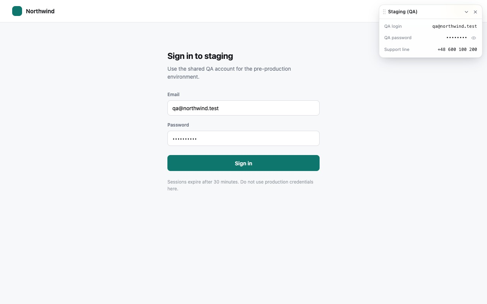

# Save Book

Keep the logins, codes and numbers you need on a specific website one click away, without leaving
the page. A small, draggable card shows your saved items on the sites you choose — and nowhere else.



## What it does

- You pick the sites; each one shows a list of items — a label plus a value, or a masked secret.
- An item is stored once and shown wherever you add it, so one staging login can live on three
  sites without being typed three times. Settings holds two views of the same data: a site's items,
  and an item's sites.
- On those sites, and only those, the card appears. Click a row to copy the value.
- Drag the card wherever suits you. Position, collapsed state and visibility are remembered per site.
- Everything is configured in the extension's settings page. Toggle the card from the toolbar icon.

## Install for testing

No toolchain needed: download `save-book-<version>.zip` from the
[latest release](../../releases/latest), unzip it, then open `chrome://extensions`, enable
**Developer mode**, click **Load unpacked**, and select the unzipped folder — the one that directly
contains `manifest.json`. It has to be unzipped first: Chrome cannot load an extension from a zip.

To build it yourself instead:

```sh
bun install
bun run build
```

Then load the `dist/` folder the same way. `bun run package` builds and produces
`release/save-book-<version>.zip` locally.

Then open the extension's options page, add a domain, and approve Chrome's prompt for that host.

## How it works

- The manifest requests **no host permissions**. Access is requested at runtime, one domain at a
  time, when you add it in the settings page.
- The service worker registers the content script only for granted, enabled domains, and hands the
  permission back when that site is removed.
- The card renders into a shadow root, so the host page's CSS cannot reach it, and it stops click
  propagation so pages never observe interaction with it.
- Items live in `chrome.storage.local` as one pool, each item carrying the sites it is shown on. A
  store written by an older version is folded into that pool on first read, one file per hop under
  `src/shared/migrations/`. There is no server and no network code.

## Development

```sh
bun install         # the committed lockfile is bun's; npm works too
bun run build       # dist/ — load this folder as an unpacked extension
bun run watch       # rebuild the content script on change
bun run typecheck   # tsc --noEmit
bun run package     # build + release/save-book-<version>.zip
```

```
src/
  background/   service worker — keeps registered content scripts in sync
  content/      the on-page card
  options/      the settings page
  shared/       schema, storage, migrations, host matching, item registry
  ui/           shared components and design tokens
store/          Chrome Web Store listing assets (icon, screenshots, promo tiles)
```

## Releasing and building

The **Release** workflow — **Actions → Release → Run workflow** — has three modes:

- **build** *(default)* — typechecks, builds, and uploads `save-book-<version>.zip` as a workflow
  artifact you can download from the run. No version gate, no tag, no release.
- **dry-run** — everything a release does, including the version gate, but publishes nothing.
- **release** — typechecks, requires a `MAJOR.MINOR.PATCH` version that is strictly higher than every
  existing `v*` tag, builds, and attaches `save-book-<version>.zip` to a new release tagged
  `v<version>`.

To cut a release: bump `version` in `public/manifest.json`, commit and push, then run the workflow in
**release** mode. That same zip is what you upload to the Chrome Web Store dashboard — the store
requires each upload to carry a higher version than the last one published.

## Privacy

Nothing you save leaves your browser. See [PRIVACY.md](PRIVACY.md) for the full policy, including
the caveat that items are stored unencrypted in your browser profile — which makes this a good fit
for test and shared accounts rather than production credentials.

Bug reports and suggestions are welcome as issues.

## License

[MIT](LICENSE) © 2026 Piotr Roszkowski
